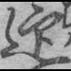
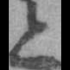
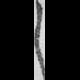
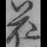
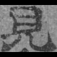
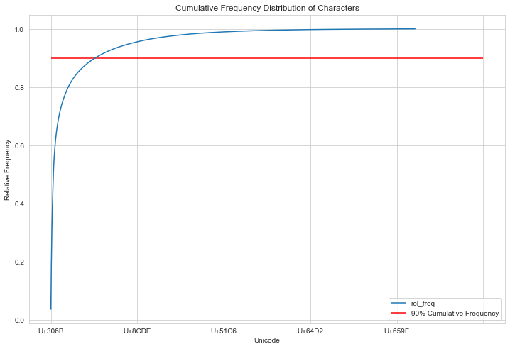

# Japanese Kuzushiji Character Classification

## Getting Started

### Contents of Repository
* **images** is a directory containing images used in this README.
* **notebooks** is a directory containing Jupyter notebooks each for
 * (1) preprocessing
 * (2) exploratory data analysis
 * (3) a baseline CNN model
 * (4a-c) transfer learning models
 * (5) a fully convolutional network
 * Two modules of helper functions (`analysis_util.py` and `my_classes.py`).
* **presentation.pdf** contains my powerpoint presentation for a non-technical audience.

### Preprocessing and EDA
The dataset is made up of 683,484 images, resized to 80x80 pixels, cast to grayscale, and zero-padded.

        

With more than 4,000 unique characters, many of which had only a handful of
training examples, I chose to keep the original character classifications only up to
a certain frequency, after which I clumped all remaining characters into
a single additional class, 'rare.' To decide that cutoff point, the training classes were sorted by decreasing frequency and plotted to more easily find the bulk of the data. I found that 90% of my data was made up of the top 513 most common characters; I kept each of those classes and made the one additional 'rare' class to group all the rarer characters together.

  

## Training Models

## Results

## Conclusion

## Author

**Stephen Lanier**  
[GitHub](https://github.com/stlanier)  
[LinkedIn](https://www.linkedin.com/in/stephen-lanier/)

## Acknowledgments

Special thanks to Jacob Eli Thomas, Victor Geislinger, and Jeff Herman, my instructors at [Flatiron School](https://flatironschool.com), for their encouragement, instruction, and guidance.

Thanks to [Kaggle](https://www.kaggle.com) for access to data from [Kuzushiji Recognition](https://www.kaggle.com/c/kuzushiji-recognition).
