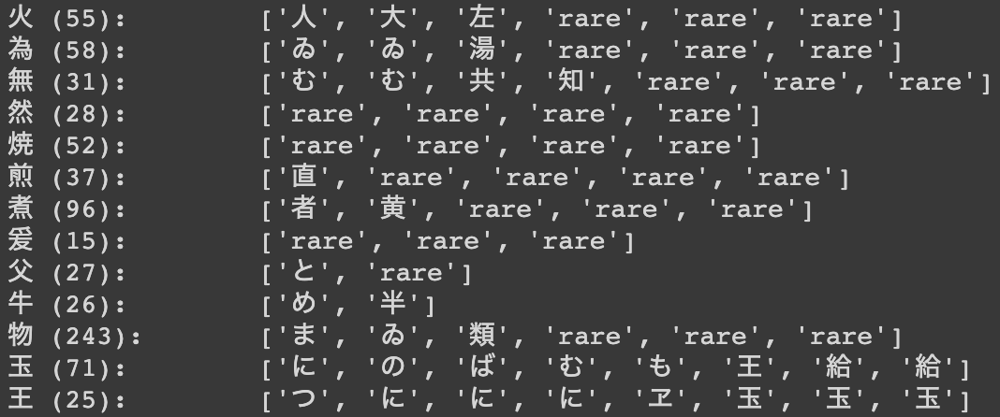

# Japanese Kuzushiji Character Classification
>“Japan has millions of books and over a billion historical documents… [and yet] there are very few fluent readers of kuzushiji today (only 0.01% of modern Japanese natives).” 
>[Kuzushiji Recognition](https://www.kaggle.com/c/kuzushiji-recognition) 

Japanese characters, of which there are more than 4,000, are especially hard to recognize as kuzushiji, cursive—font characters. The goal of this project is to create a classifier that can identify the most common of these characters and tag the remainder as rare characters. Convolutional neural networks are used, with transfer learning and a fully convolutional network explored to increase baseline performance.

## Getting Started

### Contents of Repository
* **images** is a directory containing images used in this README.
* **notebooks** is a directory containing Jupyter notebooks each for
  * (1) preprocessing
  * (2) exploratory data analysis
  * (3) a baseline CNN model
  * (4a-c) transfer learning models
  * (5) a fully convolutional network
  * Two modules of helper functions (`analysis_util.py` and `my_classes.py`).
* **presentation.pdf** contains my powerpoint presentation for a non-technical audience.

### Data
Data for this project can be downloaded from [Kuzushiji Recognition](https://www.kaggle.com/c/kuzushiji-recognition) on Kaggle at https://www.kaggle.com/c/kuzushiji-recognition.

### Preprocessing and EDA
The dataset is made up of 683484 images, resized to 80x80 pixels, cast to grayscale, and zero-padded.

      

With more than 4000 unique characters, many of which had only a handful of
training examples, I chose to keep the original character classifications only up to
a certain frequency, after which I clumped all remaining characters into
a single additional class, 'rare.' To decide that cutoff point, the training classes were sorted by decreasing frequency and plotted to more easily find the bulk of the data. I found that 90% of my data was made up of the top 513 most common characters; I kept each of those classes and made the one additional 'rare' class to group all the rarer characters together for a total of 514 classes.

  

## Training Models

### Baseline

  

* Pixel values rescaled between 0 and 1
* Conv Block
  * 32 3x3 filters, max pooling 2x2, batch normalization, ReLu
  * 64 3x3 filters, max pooling 2x2, batch normalization, ReLu
  * 128 3x3 filters, max pooling 2x2, batch normalization, ReLu
  * 256 3x3 filters, max pooling 2x2, batch normalization, ReLu
* Fully Connected Block
  * Flatten
  * Dense 5000, batch normalization, ReLu, 0.4 dropout
  * Dense 1000, batch normalization, ReLu, 0.4 dropout
* Output 514, softmax

### Transfer Learning
* Conv Base: **Xception** OR **Resnet152V2**
  * Last 6 layers unfrozen
* Global average pooling, 0.2 dropout
* Fully Connected Block
  * Dense 10000, batch normalization, ReLu, 0.3 dropout
  * Dense 5000, batch normalization, ReLu, 0.3 dropout
  * Dense 1000, batch normalization, ReLu, 0.3 dropout
* Output 514, softmax

### Fully Convolutional Network (FCN)
* Conv Block
  * 32 3x3 filters, batch normalization, ReLu
  * 64 3x3 filters, batch normalization, ReLu
  * 128 3x3 filters, batch normalization, ReLu
  * 256 3x3 filters, batch normalization, ReLu
  * 512 3x3 filters, batch normalization, ReLu
  * 1028 3x3 filters, batch normalization, ReLu
  * 514 3x3 filters, batch normalization, ReLu
* Global max pooling, softmax activation.

## Results

  

  

Despite generous use of dropout layers, all models show some signs of overfitting, seen in continued performance improvement on train data long after performance on validation has plateaued. Final accuracies on test data were as follows:

|Baseline|XCeption|ResNet152V2|InceptionResNet|FCN|
|:------:|:------:|:------:|:------:|:------:|
|0.95|0.90|0.85|NA|0.65|

To get an idea of what the model is getting wrong, here is a small view of a misclassification report, which shows the character, the number of training examples in parenthesis, and a list of ways it was misclassified:

  

Other than a slight readiness to classify characters as 'rare', many of these misclassifications are understandable, would even be hard for the human eye to distinguish in a cursive script. When the model does misclassify, it often mistakes one character for another with similar radicals, or component parts. Take, for example, the last line from the printout above: **王** was mistaken for **玉** three times and **ヱ** once.

## Conclusion

While the baseline, Xception, and ResNet models all converged and produced comparable results, The InceptionResNet and FCN models didn't produce comparable accuracies on test data AND took longer to train (in the case of the FCN, much longer). At present, those two models don't show as much promise as the first three, but I still think the FCN has potential because of its success in other arenas, namely semantic segmentation.

At present, simple seems to have been better: the best performing and also fastest converging model is the made-from-scratch "baseline," taking fewer than ~5 epochs to converge (compared to the ~10 used on transfer learning models) and achieving 0.95 accuracy on test data. These results are significant, with the model showing a level of discernment between characters that begins to rival human recognition capabilities.

The result on the from-scratch, baseline model were achieved by converting images to grayscale, zero-padding to square shapes, resizing to 80x80 pixels, and rescaling pixel values between 0 and 1. The top 513 most frequently appearing characters, making up 90% of train data, retained their classes, while the remaining, rarer characters where put into a single class (total 514 classes). The data was then fed through said relatively simple CNN, architecture above, which made heavy use of batch normalization.

## Author

**Stephen Lanier**  
[GitHub](https://github.com/stlanier)  
[LinkedIn](https://www.linkedin.com/in/stephen-lanier/)

## Acknowledgments

Special thanks to Jacob Eli Thomas, Victor Geislinger, and Jeff Herman, my instructors at [Flatiron School](https://flatironschool.com), for their encouragement, instruction, and guidance.

Thanks to [Kaggle](https://www.kaggle.com) for access to data from [Kuzushiji Recognition](https://www.kaggle.com/c/kuzushiji-recognition).
